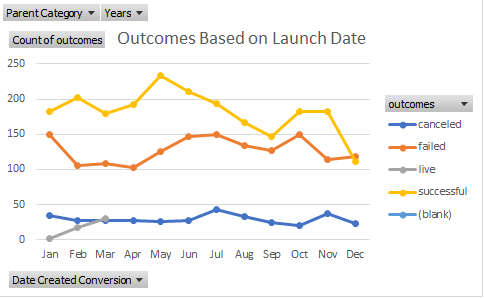

# kickstarter-analysis

## Overview of Project
The purpose of this analysis was to investigate how different campaigns fared in relation to their launch dates and their funding goals.  This written analysis explains in detail how the analysis was performed including links to pertinent images as well as any challenges that were encountered.  Finally, there is a detailed review of the results including what conclusions were drawn as well as a discussion regarding the limitations of the dataset and other charts of interest that could be created.

## Analysis & Challenges

### Analysis of Outcomes Based on Launch Date
The first data that was analyzed was the theater outcomes based on launch date.  To conduct this analysis, each campaign was divided into three groups: successful campaigns, failed campaigns and canceled campaigns.  Next, the successful campaigns, the failed campaigns and the canceled campaigns were broken down by month to show the total numbers of the respective campaigns for each month of the year (see table).  This data is visualized in the chart titled “Theater Outcomes Based on Launch Date” .
### Analysis of Outcomes Based on Goals
The second data that was analyzed was the outcomes based on campaign goals.  Again, the total number of projects was divided into three groups: successful campaigns, failed campaigns and canceled campaigns.  Next, we counted the number of successful campaigns, failed campaigns and canceled campaigns based on the goal amount for those campaigns (see table).  This data is visualized in the chart titled “Outcomes Based on Goal” .
### Challenges and Difficulties Encountered
One of the challenges I had was figuring out how to create a graph of just the data that I wanted; I thought that I needed to create a pivot table to create the chart that I wanted to make but I was able to get some help from one of my classmates via Slack and with their assistance I was able to create the graph that I desired.

## Results
1. From the analysis of theater outcomes based on launch date it is apparent that the two months of the year that coincided with the highest number of successful campaigns were May and June respectively.  Of the 839 successful theater campaigns, over 25% of those campaigns were in the months of May and June.  It is also worth noting that, with the increased number of successful campaigns during these months, there was not an increase in the number of failed campaigns that coincided with the increase in successful campaigns.  Based on that information, we can conclude that a campaign launched during the months of May or June will have higher chance of success than campaigns launched in other months.  Looking at the other side of things, the month that had the fewest successful campaigns was December with just 37 of the total 839 successful campaigns, less than 5% of the total.  December was also the month which displayed the lowest margin of any month between the number of successful campaigns and the number of failed campaigns.  Based on this information, we can conclude that a campaign launched during the month of December would have a much lower chance of success than campaigns launched in other months.  In regards to outcomes, the launch date of the campaign seemed to have little effect on the number of canceled campaigns and these numbers stayed relatively the same regardless of which month the campaign was launched.
1. From the analysis of the outcomes based on goals, it is apparent that the percentage of successful campaigns is highest when the campaign goal is less than $1000 (75.81%) and that success rate trends downward as the goal amount increases.  Consequently we see that the percentage of failed campaigns trends inversely to the successful campaigns; the percentage of failed campaigns was lowest when the campaign goal was less than $1000 (24.19%) and trended upward as the campaign goal amount increased.  Based on this information, we can conclude that campaigns with the lowest goals have the highest success rates, therefore, launching a campaign with a goal of less than $1000 will have the highest probability of achieving a successful campaign.
1. This analysis attempts to investigate how different campaigns fared in relation to their launch dates and their funding goals but the dataset provides some limitations.  One of the limitations of this dataset is that it does not measure the statistical significance of the difference in successful, failed and canceled campaigns; We can easily pick out the maximum and minimum data points but we do not know if the difference between these data points is statistically significant or not.  I also think that calculating the percentage of successful, failed and canceled campaigns based on launch date would provide more meaningful insight into the data.  Another limitation of this dataset is that when we analyze the outcomes based on goal, we find that there are much higher number of campaigns with lower goals compared to the number of campaigns with higher goals; this means that data for the campaigns with higher goals is somewhat less reliable.  Despite that campaigns with a goal in the range of $35,000 to $44,999 had a success rate of 66.67%, this data does not follow the trend of the data and while it is possible that this is a “sweet spot” for campaign goals, it is more likely that if we had additional data for these goal amounts then the percentage of successful campaigns would be lower and more in line with the trend line of what is expected.
1. As mentioned during the limitations of the dataset, I think that calculating the percentage of successful failed and canceled campaigns based on launch date would provide more meaningful insight into the data which could be visualized in another table or graph.  Other graphs that could be included would be graphs of the theater outcomes based on launch date for each year.  When we compare the data year by year we could see if the outcomes based on launch date trends are consistent each year or if there is one year (like a pandemic year) where the data is skewed.
